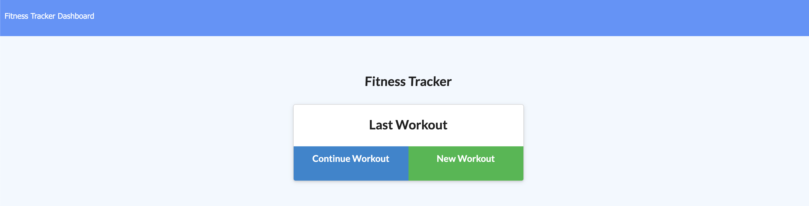

<h1 align="center">
Workout Tracker
</h1>
<h4 align="center" style="margin-bottom:10px">Be sure to star my configuration repo so you can keep up to date on any daily progress!</h4>

  <h4>
    </a>
    
    
        
</h4>
 

This is a workout tracker application.

  <h4>
    <a href="#">
      Heroku
    </a>
     | 
    <a href="https://github.com/adbergen/workout-tracker">
      Github
    </a>

  </h4>

## Table of Contents

- [Installation](#installation)
- [Usage](#usage)
- [Technologies](#technologies)
- [Contributing](#contributing)

## Installation

 
Using npm:

 
 

    npm install

## Usage

 This application is designed to allow a user to view, create, and track daily workouts. Multiple Exercises in a workout can be logged each day. The name, type, weight, sets, reps, distance traveled, duration of excercise, can also be logged.

## Technologies

<ul>
<li>HTML, CSS, Bootstrap</li>
<li>Javascript, jQuery</li>
<li>MongoDB</li>
<li>node.js, Express, Seqeulize, MySQL, dotenv, Passport, Bcrypt</li>
<li>GitHub, Heroku</li>
</ul>

## Contributing

- Pull requests are welcome. For major changes, please open an issue first to discuss what you would like to change.

- Contributors: Anthony Bergen

